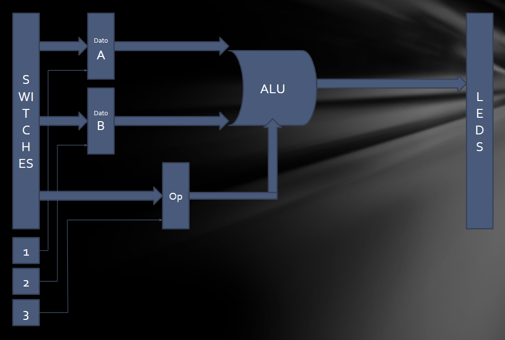

# Lab 1: Arithmetic Logic Unit (ALU)

## Objetivos

- [ ] Implementar en FPGA una ALU.
- [ ] La ALU debe ser parametrizable (bus de datos) para poder ser utilizada posteriormente en el trabajo final.
- [ ] Validar el desarrollo por medio de Testbench.
  - [ ] El testbench debe incluir generacion de entradas aleatorias y codigo de checkeo automatico.
- [ ] Simular el disenio usando herramientas de simulacion de VIVADO incluyendo Analisis de Tiempo.

## Descripcion del Trabajo

### Operaciones a Implementar

La ALU debe implementar las siguientes operaciones:

| Operacion | Codigo | Decripcion |
|-----------|--------|------------|
| ADD | 100000 | Suma |
| SUB | 100010 | Resta |
| AND | 100100 | AND lógica |
| OR  | 100101 | OR lógica |
| XOR | 100110 | XOR lógica |
| SRA | 000011 | Shift Right Arithmetic |
| SRL | 000010 | Shift Right Logical |
| NOR | 100111 | NOR lógica |

### Schematics

