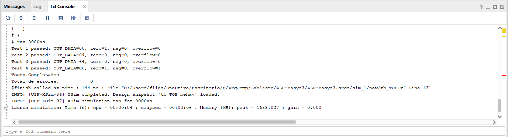

# Lab 1: Arithmetic Logic Unit (ALU)

## Objetivos

- [ ] Implementar en FPGA una ALU.
- [X] La ALU debe ser parametrizable (bus de datos) para poder ser utilizada posteriormente en el trabajo final.
- [X] Validar el desarrollo por medio de Testbench.
  - [X] El testbench debe incluir generacion de entradas aleatorias y codigo de checkeo automatico.
- [X] Simular el diseño usando herramientas de simulacion de VIVADO incluyendo Analisis de Tiempo.

## Consignas

### Operaciones a Implementar

La ALU debe implementar las siguientes operaciones:

<div align="center">

| Operacion | Codigo | Decripcion |
|-----------|--------|------------|
| ADD | 100000 | Suma |
| SUB | 100010 | Resta |
| AND | 100100 | AND lógica |
| OR  | 100101 | OR lógica |
| XOR | 100110 | XOR lógica |
| SRA | 000011 | Shift Right Arithmetic |
| SRL | 000010 | Shift Right Logical |
| NOR | 100111 | NOR lógica |

</div>

### Schematics

<div align="center">
    
</div>

## Desarrollo

### Implementacion de la ALU ([`ALU.v`](./src/ALU-Basys3/ALU-Basys3.srcs/sources_1/new/ALU.v))

Una ALU es un componente fundamental en los sistemas digitales que realiza operaciones aritméticas y lógicas en datos binarios. La implementación de una ALU en FPGA permite una gran flexibilidad y personalización en el diseño de sistemas digitales.

#### Parametrización del Bus de Datos

Para hacer la ALU parametrizable, se utilizan *parámetros de modulo* predefinidos, estos delimitan el ancho del bus de datos, permitiendo que la implementación de la ALU pueda ser utilizada con diferentes tamaños de datos sin necesidad de modificar el código fuente, pero permitiendo tambien un caso base. Para cambiar el ancho del bus de datos simplemente se debe modificar el valor del parametro `DATA_WIDTH` al instanciar el modulo. 

El resto de la implementacion de la ALU se adapta automaticamente al nuevo ancho del bus de datos.

>[!IMPORTANT]
>El valor del parametro `OP_WIDTH`, si bien es parametrizable, no debe ser modificado, ya que esta directamente relacionado con la definicion de las operaciones y el selector del multiplexor.

**Declaracion del Modulo ALU parametrizable:**

```Verilog
module ALU #(parameter DATA_WIDTH = 8, parameter OP_WIDTH = 6) (
    input wire [DATA_WIDTH-1:0] A,
    input wire [DATA_WIDTH-1:0] B,
    input wire [OP_WIDTH-1:0] OP,
    output reg [DATA_WIDTH-1:0] result,
    output reg zero, overflow, negative
);

// ... Resto del codigo de la ALU ...

endmodule
```

#### Operaciones y Flags de Estado

La ALU implementa las siguientes operaciones:

- `ADD`: Suma de dos operandos.
- `SUB`: Resta de dos operandos.
- `AND`: Operación AND lógica.
- `OR`: Operación OR lógica.
- `XOR`: Operación XOR lógica.
- `SRA`: Desplazamiento a la derecha aritmético.
- `SRL`: Desplazamiento a la derecha lógico.
- `NOR`: Operación NOR lógica.

Las mismas se seleccionan mediante un multiplexor controlado por el valor registrado en el bus de operador (`OP`). Y se implementan utilizando una estructura `case` dentro de un bloque `always`. 

Tambien incluye tres flags de estado que proporcionan información adicional sobre el resultado de las operaciones: `zero`, `overflow` y `negative`.

- `zero`: Indica si el resultado de la operación es cero.
- `overflow`: Indica si ha ocurrido un desbordamiento en operaciones aritméticas.
- `negative`: Indica si el resultado de la operación es negativo.

**Implementacion de las Operaciones y Flags:**

```Verilog
/// ... Declaracion del Modulo ...

    always @(*) begin
        overflow = 0;
        
        case (OP)
            `ADD: {overflow, result} = {1'b0, A} + {1'b0, B};
            `SUB: {overflow, result} = {1'b0, A} - {1'b0, B};
            `AND: result = A & B;
            `OR:  result = A | B;
            `XOR: result = A ^ B;
            `NOR: result = ~(A | B);
            `SRA: result = $signed(A) >>> B;
            `SRL: result = A >> B;
            default: result = {DATA_WIDTH{1'b0}};
        endcase
      
        zero = (result == 0);
        negative = result[DATA_WIDTH-1] && (OP == `ADD || OP == `SUB || OP == `SRA);
    end

/// ... Resto del codigo de la ALU ...
```

#### Schematics de ALU

Luego de realizar la implementacion de la ALU, se puede observar el siguiente esquema del circuito sintetizado:

<div align="center">
    
</div>

>[!NOTE]
>El esquema presentado es una representación simplificada y visual de la ALU, el cual no refleja realmente su implementacion interna, si observamos el esquema sintetizado real este muestra combinaciones de bloques LUTs y CARRY, que es la forma en que se implementan las operaciones aritméticas y lógicas en FPGAs.

### Registros Intermedios ([`REG.v`](./src/ALU-Basys3/ALU-Basys3.srcs/sources_1/new/REG.v))

Para implementar la logica previa al ingreso de datos a la ALU, se utilizan registros intermedios que almacenan temporalmente los datos de entrada ingresados (por medio de los switches) actuando como buffers. Estos registros permiten que los datos sean procesados de manera eficiente y sincrónica, asegurando que la ALU reciba los valores correctos en el momento adecuado.

Para la carga y limpieza de estos registros, se utilizan botones que actúan como señales de control. Contamos con un boton para cada registro (`select_a`, `select_c` y `select_op`) y un boton de reset (`reset`). Los mismos se encuentran dentro del modulo superior (`TOP.v`) y permiten cargar los datos desde los switches a los registros intermedios o limpiar su contenido.

**Implementacion de Registros Intermedios:**

```Verilog
module REG #(parameter DATA_WIDTH = 8) (
    input wire clk, reset, select,
    input wire [DATA_WIDTH-1:0] IN,
    output reg [DATA_WIDTH-1:0] OUT
);

    always @(posedge clk) begin
        if (reset) begin
            OUT <= {DATA_WIDTH{1'b0}};
        end
        else if(select) begin
            OUT <= IN;
        end
    end

endmodule
```

**Schematics de Registros Intermedios:**

<div align="center">
    
</div>

### Modulo Superior ([`TOP.v`](./src/ALU-Basys3/ALU-Basys3.srcs/sources_1/new/TOP.v))

El modulo superior (`TOP.v`) integra la ALU y los registros intermedios, gestionando la interaccion con los switches, botones de la FPGA y salida a LEDs. Este modulo se encarga de instanciar el resto de los modulos, coordinar la carga de datos en los registros, la seleccion de operaciones y la visualizacion de resultados.

**Implementacion del Modulo Superior:**

```Verilog
module TOP #(parameter DATA_WIDTH = 8, parameter OP_WIDTH = 6) (
    input wire clk, reset,
    input wire select_a, select_b, select_op,
    input wire [DATA_WIDTH-1:0] IN_DATA,
    output wire [DATA_WIDTH-1:0] OUT_DATA,
    output wire zero, overflow, negative
);

    wire [DATA_WIDTH-1:0] REG_A, REG_B;
    wire [OP_WIDTH-1:0] REG_OP;
    
    // Registros Intermedios
    REG #(DATA_WIDTH) reg_a (
        .clk(clk),
        .reset(reset),
        .select(select_a),
        .IN(IN_DATA),
        .OUT(REG_A)
    );

    REG #(DATA_WIDTH) reg_b (
        .clk(clk),
        .reset(reset),
        .select(select_b),
        .IN(IN_DATA),
        .OUT(REG_B)
    );

    REG #(OP_WIDTH) reg_op (
        .clk(clk),
        .reset(reset),
        .select(select_op),
        .IN(IN_DATA[OP_WIDTH-1:0]),
        .OUT(REG_OP)
    );

    // ALU
    ALU #(DATA_WIDTH, OP_WIDTH) alu_a (
        .A(REG_A),
        .B(REG_B),
        .OP(REG_OP),
        .result(OUT_DATA),
        .zero(zero),
        .overflow(overflow),
        .negative(negative)
    );

endmodule
```

**Schematics del Modulo Superior:**

<div align="center">
    
</div>

### Constraints ([`Basys-3-Master.xdc`](./src/ALU-Basys3/ALU-Basys3.srcs/constrs_1/new/Basys-3-Master.xdc))

El archivo de constraints (`.xdc`) define las conexiones entre los pines de la FPGA y los componentes externos, como switches, botones y LEDs. Asegurando que las señales de entrada y salida estén correctamente mapeadas para el funcionamiento del diseño.

**Distribucion de Placa Basys 3:**

<div align="center">
    
</div>

Partiendo del archivo base proporcionado por Diligent, se realizaron unas modificaciones para adaptar las conexiones a los requerimientos del proyecto.

**Archivo de Constraints Modificado:**

```python
## Clock signal
set_property -dict { PACKAGE_PIN W5   IOSTANDARD LVCMOS33 } [get_ports clk]
create_clock -add -name sys_clk_pin -period 10.000 -waveform {0 5} [get_ports clk]

## Switches
set_property -dict { PACKAGE_PIN V17   IOSTANDARD LVCMOS33 } [get_ports {IN_DATA[0]}]
set_property -dict { PACKAGE_PIN V16   IOSTANDARD LVCMOS33 } [get_ports {IN_DATA[1]}]
set_property -dict { PACKAGE_PIN W16   IOSTANDARD LVCMOS33 } [get_ports {IN_DATA[2]}]
set_property -dict { PACKAGE_PIN W17   IOSTANDARD LVCMOS33 } [get_ports {IN_DATA[3]}]
set_property -dict { PACKAGE_PIN W15   IOSTANDARD LVCMOS33 } [get_ports {IN_DATA[4]}]
set_property -dict { PACKAGE_PIN V15   IOSTANDARD LVCMOS33 } [get_ports {IN_DATA[5]}]
set_property -dict { PACKAGE_PIN W14   IOSTANDARD LVCMOS33 } [get_ports {IN_DATA[6]}]
set_property -dict { PACKAGE_PIN W13   IOSTANDARD LVCMOS33 } [get_ports {IN_DATA[7]}]

## LEDs
set_property -dict { PACKAGE_PIN U16   IOSTANDARD LVCMOS33 } [get_ports {OUT_DATA[0]}]
set_property -dict { PACKAGE_PIN E19   IOSTANDARD LVCMOS33 } [get_ports {OUT_DATA[1]}]
set_property -dict { PACKAGE_PIN U19   IOSTANDARD LVCMOS33 } [get_ports {OUT_DATA[2]}]
set_property -dict { PACKAGE_PIN V19   IOSTANDARD LVCMOS33 } [get_ports {OUT_DATA[3]}]
set_property -dict { PACKAGE_PIN W18   IOSTANDARD LVCMOS33 } [get_ports {OUT_DATA[4]}]
set_property -dict { PACKAGE_PIN U15   IOSTANDARD LVCMOS33 } [get_ports {OUT_DATA[5]}]
set_property -dict { PACKAGE_PIN U14   IOSTANDARD LVCMOS33 } [get_ports {OUT_DATA[6]}]
# ... (5 LEDs no utilizados) ...
set_property -dict { PACKAGE_PIN N3    IOSTANDARD LVCMOS33 } [get_ports negative]
set_property -dict { PACKAGE_PIN P1    IOSTANDARD LVCMOS33 } [get_ports overflow]
set_property -dict { PACKAGE_PIN L1    IOSTANDARD LVCMOS33 } [get_ports zero]

## Buttons
set_property -dict { PACKAGE_PIN U18   IOSTANDARD LVCMOS33 } [get_ports reset]
set_property -dict { PACKAGE_PIN W19   IOSTANDARD LVCMOS33 } [get_ports select_a]
set_property -dict { PACKAGE_PIN T17   IOSTANDARD LVCMOS33 } [get_ports select_b]
set_property -dict { PACKAGE_PIN U17   IOSTANDARD LVCMOS33 } [get_ports select_op]
```

**Tabla de Asignacion de Pines:**

<div align="center">

| Señal | Pin/Pines (LSB-MSB)  | Descripcion |
|-------|------------|-------------|
| clk   | W5         | Señal de reloj principal (100MHz) |
| IN_DATA[7:0] | V17, V16, W16, W17, W15, V15, W14, W13 | Switches para entrada de datos y operacion |
| OUT_DATA[7:0] | U16, E19, U19, V19, W18, U15, U14 | LEDs para mostrar el resultado de la ALU |
| zero  | L1         | LED que indica si el resultado es cero |
| overflow | P1         | LED que indica si hay desbordamiento |
| negative | N3         | LED que indica si el resultado es negativo |
| reset | U18        | Boton para resetear los registros intermedios |
| select_a | W19        | Boton para cargar el valor del switch al registro A |
| select_b | T17        | Boton para cargar el valor del switch al registro B |
| select_op | U17        | Boton para cargar el valor del switch al registro OP |

</div>

### Testbenches

#### Testbench del Modulo ALU ([`TB_ALU.v`](./src/ALU-Basys3/ALU-Basys3.srcs/sim_1/new/tb_ALU.v))

Este testbench valida el correcto funcionamiento de la ALU, generando aleatoriamente dos datos a procesar y eligiendo una operacion a realizar. Luego compara el resultado obtenido con el esperado, verificando tambien los flags de estado, asegurando que la ALU funcione correctamente o aumentando el contador de errores en caso de fallas. En esta intancia se realizan 256 pruebas aleatorias.

>[!WARNING]
>Se debe modificar la configuracion de VIVADO para aumentar el tiempo de simulacion, este por defecto es de 1000 ns. En este testbench, con 256 pruebas, el tiempo de simulacion requerido fue de aproximadamente 2500 ns.

**Código del Testbench:**

```Verilog
`timescale 1ns / 1ps

// Ocho operaciones
`define ADD 6'b100000
`define SUB 6'b100010
`define AND 6'b100100
`define OR  6'b100101
`define XOR 6'b100110
`define NOR 6'b100111
`define SRA 6'b000011
`define SRL 6'b000010

module tb_ALU ();
    parameter DATA_WIDTH = 8;
    parameter OP_WIDTH = 6;

    reg [DATA_WIDTH-1:0] A, B;
    reg [OP_WIDTH-1:0] OP;
    reg [OP_WIDTH-1:0] OP_Array [7:0];
    wire [DATA_WIDTH-1:0] RESULT;
    wire ZERO, NEG, OVERFLOW;

    ALU #(DATA_WIDTH, OP_WIDTH) uut_alu (
        .A(A), .B(B), .OP(OP),
        .result(RESULT),
        .zero(ZERO),
        .negative(NEG),
        .overflow(OVERFLOW)
    );

    integer n, errors = 0;
    reg [DATA_WIDTH-1:0] expected_result;
    reg expected_zero, expected_overflow, expected_negative;

    initial begin
        OP_Array[0] = `ADD;
        OP_Array[1] = `SUB;
        OP_Array[2] = `AND;
        OP_Array[3] = `OR;
        OP_Array[4] = `XOR;
        OP_Array[5] = `NOR;
        OP_Array[6] = `SRA;
        OP_Array[7] = `SRL;
    end

    task check_results;
        if (RESULT != expected_result || ZERO != expected_zero || NEG != expected_negative || OVERFLOW != expected_overflow) begin
            $display("Test failed for A=%h, B=%h, OP=%b", A, B, OP);
            $display("Expected: RESULT=%h, ZERO=%b, NEG=%b, OVERFLOW=%b", expected_result, expected_zero, expected_negative, expected_overflow);
            $display("Got:      RESULT=%h, ZERO=%b, NEG=%b, OVERFLOW=%b", RESULT, ZERO, NEG, OVERFLOW);
            errors = errors + 1;
        end 
        else begin
            $display("Test passed for A=%h, B=%h, OP=%b, n=%d", A, B, OP, n);
        end
    endtask
    
    initial begin
        A = 0; B = 0; OP = 0;

        #10;

        for (n = 0; n < 256; n = n + 1) begin
            A = $random;
            B = $random;
            OP = OP_Array[$urandom % 8];
            
            expected_overflow = 0;
            expected_negative = 0;

            #10;

            case(OP)
                `ADD: {expected_overflow, expected_result} = {1'b0, A} + {1'b0, B};
                `SUB: {expected_overflow, expected_result} = {1'b0, A} - {1'b0, B};
                `AND: expected_result = A & B;
                `OR:  expected_result = A | B;
                `XOR: expected_result = A ^ B;
                `NOR: expected_result = ~(A | B);
                `SRA: expected_result = $signed(A) >>> B;
                `SRL: expected_result = A >> B;
                default: expected_result = {DATA_WIDTH{1'b0}};
            endcase

            expected_zero = (expected_result == 0);
            expected_negative = expected_result[DATA_WIDTH-1] && (OP == `ADD || OP == `SUB || OP == `SRA);
            
            check_results;
        end

        $display ("TEST COMPLETADOS");
        $display ("TOTAL DE ERRORES: %d", errors);
        $finish;
    end

endmodule
```

#### Testbench del Modulo REG ([`TB_REG.v`](./src/ALU-Basys3/ALU-Basys3.srcs/sim_1/new/tb_REG.v))

Este testbench valida el correcto funcionamiento del modulo REG, asegurando que los datos se carguen correctamente en el registro cuando se activa la señal de seleccion, se retenga el valor al mantener la señal de seleccion en bajo y que el registro se limpie adecuadamente cuando se activa la señal de reset, tambien en este test se comprueba el correcto funcionamiento de la parametrizacion del modulo, instanciando dos registros con diferentes anchos de bus de datos (8 bits y 6 bits). Asi como tambien tests aleatorios de carga de datos.

**Código del Testbench:**

```Verilog
`timescale 1ns / 1ps

module tb_REG ();
    parameter DATA_WIDTH = 8;
    parameter OP_WIDTH = 6;

    reg clk, reset, select;

    reg [DATA_WIDTH-1:0] IN_DATA;
    wire [DATA_WIDTH-1:0] OUT_DATA;

    reg [OP_WIDTH-1:0] IN_OP;
    wire [OP_WIDTH-1:0] OUT_OP;

    reg [DATA_WIDTH-1:0] expected_data;
    reg [OP_WIDTH-1:0] expected_op;
    
    integer i, errors = 0;

    REG #(DATA_WIDTH) uut_data (
        .clk(clk),
        .reset(reset),
        .select(select),
        .IN(IN_DATA),
        .OUT(OUT_DATA)
    );

    REG #(OP_WIDTH) uut_op (
        .clk(clk),
        .reset(reset),
        .select(select),
        .IN(IN_OP),
        .OUT(OUT_OP)
    );

    initial begin
        clk = 0;
        forever #4 clk = ~clk;
    end

    task check_results;
        input integer cycle;

        begin @(negedge clk);
            if (OUT_DATA !== expected_data || OUT_OP !== expected_op) begin
                $display("DATA: Expected OUT=%b, Got OUT=%b", expected_data, OUT_DATA);
                $display("OP:   Expected OUT=%b, Got OUT=%b", expected_op, OUT_OP);
                errors = errors + 1;
            end
            else begin
                $display("Test %0d passed: OUT_DATA=%b, OUT_OP=%b", cycle, OUT_DATA, OUT_OP);
                $display("DATA: Expected OUT=%b, Got OUT=%b", expected_data, OUT_DATA);
                $display("OP:   Expected OUT=%b, Got OUT=%b", expected_op, OUT_OP);
            end
        end
    endtask
    
    initial begin
        reset = 0; select = 0; IN_DATA = 0; IN_OP = 0;
        expected_data = 0; expected_op = 0;
        @(negedge clk); // Esperar un ciclo de reloj

        // Test 1: Reset
        reset = 1; select = 0;
        IN_DATA = 8'hAA; IN_OP = 6'b101010;
        @(posedge clk); // Reset on posedge
        expected_data = 0; expected_op = 0;
        check_results(1);

        // Test 2: Seleccion de Datos
        reset = 0; select = 1;
        IN_DATA = 8'h55; IN_OP = 6'b110011;
        @(posedge clk);
        expected_data = 8'h55; expected_op = 6'b110011;
        check_results(2);

        // Test 3: Select = 0 (retener valor anterior)
        select = 0;
        IN_DATA = 8'hFF; IN_OP = 6'b111111;
        @(posedge clk);
        expected_data = 8'h55; expected_op = 6'b110011;
        check_results(3);

        // Tests Aleatorios
        for (i = 4; i < 35; i = i + 1) begin
            reset = $urandom % 2;
            select = $urandom % 2;
            IN_DATA = $urandom;
            IN_OP = $urandom;

            @(posedge clk);

            if (reset) begin
                expected_data = 0; expected_op = 0;
            end 
            else if (select) begin
                expected_data = IN_DATA; expected_op = IN_OP;
            end
            
            check_results(i);
        end
    
        $display("Tests Completados");
        $display("Total de errores: %d", errors);
        $finish;
    end
    
endmodule
```

#### Testbench del Modulo TOP ([`TB_TOP.v`](./src/ALU-Basys3/ALU-Basys3.srcs/sim_1/new/tb_TOP.v))

En este testbench se valida el correcto funcionamiento del modulo superior, integrando la ALU y los registros intermedios. Se simula la carga de datos en los registros, la seleccion de operaciones y la visualizacion de resultados, asegurando que todo el sistema funcione correctamente en conjunto.

```Verilog
`timescale 1ns / 1ps

`define ADD 6'b100000

module tb_TOP ();
    parameter DATA_WIDTH = 8;
    parameter OP_WIDTH = 6;

    reg clk, reset, select_a, select_b, select_op;
    reg [DATA_WIDTH-1:0] IN_DATA;
    wire [DATA_WIDTH-1:0] OUT_DATA;
    wire zero, negative, overflow;

    // Valores esperados
    reg [DATA_WIDTH-1:0] expected_result;
    reg expected_zero, expected_negative, expected_overflow;
    
    integer errors = 0;

    TOP #(DATA_WIDTH, OP_WIDTH) uut_top (
        .clk(clk), .reset(reset),
        .select_a(select_a), .select_b(select_b), .select_op(select_op),
        .IN_DATA(IN_DATA),
        .OUT_DATA(OUT_DATA),
        .zero(zero), .negative(negative), .overflow(overflow)
    );

    initial begin
        clk = 0;
        forever #4 clk = ~clk;
    end
    
    task check_results;
        input integer test;

        begin
            @(negedge clk); // Para asegurar que los registros se actualizaron
            if (OUT_DATA != expected_result || zero != expected_zero || negative != expected_negative || overflow != expected_overflow) begin
                $display("Test %0d failed", test);
                $display("Expected: OUT_DATA=%h, zero=%b, neg=%b, overflow=%b", expected_result, expected_zero, expected_negative, expected_overflow);
                $display("Got:      OUT_DATA=%h, zero=%b, neg=%b, overflow=%b", OUT_DATA, zero, negative, overflow);
                errors = errors + 1;
            end
            else begin
                $display("Test %0d passed: OUT_DATA=%h, zero=%b, neg=%b, overflow=%b", test, OUT_DATA, zero, negative, overflow);
            end
        end
    endtask

    initial begin
        reset = 0; select_a = 0; select_b = 0; select_op = 0; IN_DATA = 0;
        expected_result = 0; expected_zero = 1; expected_negative = 0; expected_overflow = 0;
        @(negedge clk);

        // Test 1: Reinicio de registros
        IN_DATA = 8'hAA;
        reset = 1; select_a = 0; select_b = 0; select_op = 0;
        @(posedge clk);

        @(negedge clk);
        expected_result = 0; expected_zero = 1; expected_negative = 0; expected_overflow = 0;
        check_results(1);

        // Test 2: A, B y ADD
        @(negedge clk);
        reset = 0;
        IN_DATA = 8'h20;
        select_a = 1; select_b = 0; select_op = 0;
        @(posedge clk);

        @(negedge clk);
        select_a = 0;
        IN_DATA = 8'h44;
        select_b = 1;
        @(posedge clk);

        @(negedge clk);
        select_b = 0;
        IN_DATA = `ADD;
        select_op = 1;
        @(posedge clk);

        @(negedge clk);
        select_op = 0;
        @(posedge clk);

        @(negedge clk);
        expected_result = 8'h64; // 0x20 + 0x44
        expected_zero = 0; expected_negative = 0; expected_overflow = 0;
        check_results(2);

        // Test 3: Retencion de valores (no se selecciona nada)
        @(negedge clk);
        IN_DATA = 8'hFF;
        select_a = 0; select_b = 0; select_op = 0;
        @(posedge clk);

        @(negedge clk);
        expected_result = 8'h64; // Debe mantenerse el resultado anterior
        expected_zero = 0; expected_negative = 0; expected_overflow = 0;
        check_results(3);

        // Test 4: Overflow (ADD: 0xFF + 0x01)
        @(negedge clk);
        reset = 0;
        select_a = 1; select_b = 0; select_op = 0;
        IN_DATA = 8'hFF;
        @(posedge clk);

        @(negedge clk);
        select_a = 0; select_b = 1;
        IN_DATA = 8'h01;
        @(posedge clk);

        @(negedge clk);
        select_b = 0; select_op = 1;
        IN_DATA = `ADD;
        @(posedge clk);

        @(negedge clk);
        select_op = 0;
        @(posedge clk);

        @(negedge clk);
        expected_result = 8'h00; // 0xFF + 0x01
        expected_zero = 1; expected_negative = 0; expected_overflow = 1;
        check_results(4);

        $display("Tests Completados");
        $display("Total de errores: %d", errors);
        $finish;
    end

endmodule
```

### Simulacion

**Captura de Simulacion ALU:**

<div align="center">
    
</div>

**Captura de Simulacion REG:**

<div align="center">
    
</div>

**Captura de Simulacion TOP:**

<div align="center">
    
</div>

### Analisis de Tiempo

Se realizo un analisis de tiempo utilizando las herramientas de VIVADO para asegurar que el diseño cumple con los requisitos de temporizacion. El analisis mostro que el diseño es capaz de operar a la frecuencia objetivo de 100 MHz sin violaciones de tiempo, garantizando un rendimiento adecuado para aplicaciones futuras.

El siguiente fragmento de codigo muestra las restricciones de tiempo aplicadas en el archivo de constraints ([`Basys-3-Master.xdc`](./src/ALU-Basys3/ALU-Basys3.srcs/constrs_1/new/Basys-3-Master.xdc)): 

- **Restricciones de entrada:** max delay de 5 ns para las entradas de datos y control.
- **Restricciones de salida:** max delay de 5 ns para las salidas de datos y flags.
- **Extra:** Reset como entrada rápidas (0 ns delay)

```Python
## Timing Constraints
set_input_delay -clock sys_clk_pin -max 5.000 [get_ports {IN_DATA[*]}]
set_input_delay -clock sys_clk_pin -max 5.000 [get_ports {select_a select_b select_op reset}]
set_output_delay -clock sys_clk_pin -max 5.000 [get_ports {OUT_DATA[*]}]
set_output_delay -clock sys_clk_pin -max 5.000 [get_ports {zero negative overflow}]
set_false_path -from [get_ports reset]
```

#### Primer Iteracion: FALLIDA

<div align="center">
    
</div>

#### Segunda Iteracion: EXITOSA

En esta instancia se relajaron las restricciones, permitiendo a VIVADO optimizar mejor el diseño y cumplir con los requisitos de temporizacion. Tambien se definieron caminos multicycle para los registros intermedios, permitiendo que las señales tengan mas de un ciclo de reloj para estabilizarse.

```Python
## Timing Constraints
set_false_path -from [get_ports reset]
set_false_path -from [get_ports {select_a select_b select_op}]
set_false_path -to [get_ports {zero negative overflow}]
set_false_path -to [get_ports {OUT_DATA[*]}]

## Multicycle paths para registros (2 ciclos)
set_multicycle_path -setup 2 -from [get_pins reg_a*/C] [get_pins reg_b*/C] [get_pins reg_op*/C]
set_multicycle_path -hold 1 -from [get_pins reg_a*/C] [get_pins reg_b*/C] [get_pins reg_op*/C]
```

<div align="center">
    
</div>

## Conclusiones


